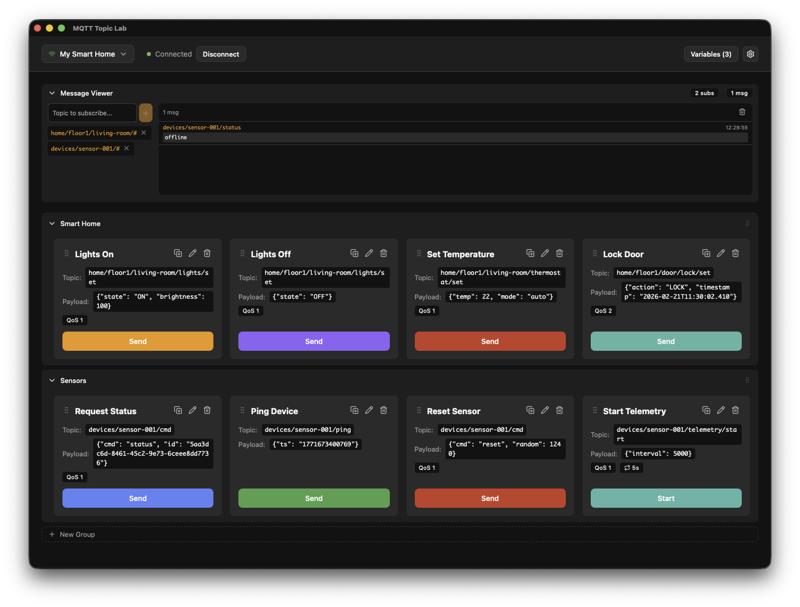
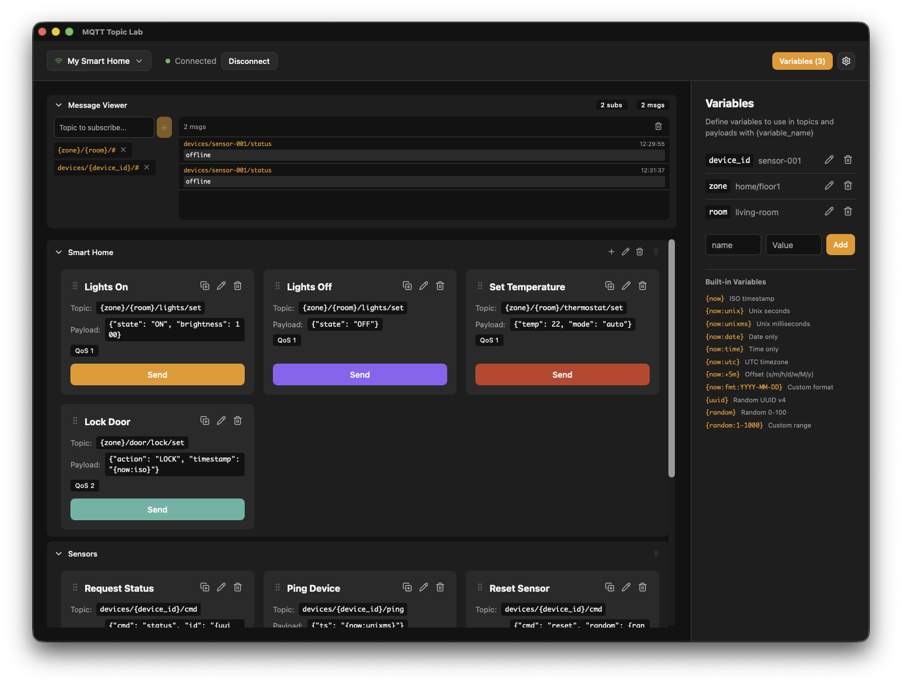

# MQTT Topic Lab

A desktop application for sending saved MQTT commands via configurable buttons. Built with Tauri (Rust) and React.



## Features

- **Button Commands**: Create buttons with customizable topics, payloads, QoS levels, and retain flags
- **Project Variables**: Define variables like `device_id` once, use them across buttons with `{device_id}` syntax
- **Multi-send**: Send messages repeatedly at configurable intervals
- **Message Viewer**: Subscribe to topics and monitor incoming messages in real-time
- **Multiple Connections**: Switch between different MQTT brokers
- **Button Groups**: Organize buttons into collapsible groups with drag-and-drop reordering
- **Import/Export**: Share connection configurations as JSON files
- **Auto-connect**: Automatically connects to your MQTT broker on startup
- **TLS Support**: Secure connections with TLS/SSL
- **Automatic Updates**: Opt-in checks for new releases on GitHub, with one-click download & install
- **Cross-platform**: Works on Windows, Linux, and macOS

## Variables

Use `{variable_name}` syntax in topics and payloads. Variables are defined per connection in the Variables panel. When the panel is open, buttons and subscriptions show the raw templates so you can see which variables are used where.



### Custom Variables

Define your own variables like `device_id = "sensor-001"`, then use `{device_id}` in topics or payloads.

### Built-in Variables

| Variable | Description | Example Output |
|----------|-------------|----------------|
| `{now}` | ISO 8601 timestamp | `2026-02-19T14:30:00.000Z` |
| `{now:unix}` | Unix timestamp (seconds) | `1771508400` |
| `{now:unixms}` | Unix timestamp (milliseconds) | `1771508400000` |
| `{now:date}` | Date only | `2026-02-19` |
| `{now:time}` | Time only | `14:30:00` |
| `{now:datetime}` | Date and time | `2026-02-19 14:30:00` |
| `{uuid}` | Random UUID v4 | `a1b2c3d4-e5f6-4a7b-8c9d-e0f1a2b3c4d5` |
| `{random}` | Random integer 0-100 | `42` |
| `{random:1-1000}` | Random integer in range | `537` |

`{timestamp}` is an alias for `{now}`, and `{rand}` is an alias for `{random}`.

### Modifiers

Modifiers are added with `:` after the variable name and can be combined.

**Time offsets**: `{now:+5m}`, `{now:-1h}`, `{now:+7d}`, `{now:+2w}`, `{now:+1M}`, `{now:+1y}`
- Units: `s` (seconds), `m` (minutes), `h` (hours), `d` (days), `w` (weeks), `M` (months), `y` (years)

**Timezone**: `{now:utc}` or `{now:local}` (default is local)

**Custom format**: `{now:fmt:YYYY-MM-DD}`, `{now:fmt:HH:mm:ss}`
- Tokens: `YYYY`, `YY`, `MM`, `M`, `DD`, `D`, `HH`, `H`, `mm`, `ss`, `SSS`

**Combined**: `{now:unix:+1h}`, `{now:utc:fmt:YYYY-MM-DD_HH:mm}`

## Keyboard Shortcuts

| Shortcut | Action |
|----------|--------|
| `⌘/Ctrl + 1-9, 0` | Quick send buttons 1-10 |
| `Arrow keys` | Navigate between buttons |
| `Enter` | Send selected button |
| `Escape` | Deselect button / Close search |
| `⌘/Ctrl + N` | New button |
| `⌘/Ctrl + E` | Edit selected button |
| `⌘/Ctrl + C` | Copy selected button |
| `⌘/Ctrl + V` | Paste copied button |
| `⌘/Ctrl + D` | Duplicate selected button |
| `⌘/Ctrl + F` | Search buttons |
| `⌘/Ctrl + T` | Toggle message viewer |
| `⌘/Ctrl + ,` | Open Preferences |
| `⌘/Ctrl + .` | Open Connection Settings |
| `Delete / Backspace` | Delete selected button |

## Getting Started

### Prerequisites

- [Node.js](https://nodejs.org/) (v18+)
- [Rust](https://rustup.rs/)
- Platform-specific dependencies for Tauri (see [Tauri Prerequisites](https://tauri.app/start/prerequisites/))

### Development

```bash
npm install
npm run tauri dev
```

### Testing

```bash
npm test                    # Frontend tests
cd src-tauri && cargo test  # Backend tests
```

### Building

```bash
npm run tauri build
```

Release builds produce signed auto-updater artifacts, so `npm run tauri build` requires the updater signing key in the environment (`npm run tauri dev` does not):

```bash
export TAURI_SIGNING_PRIVATE_KEY="$(cat src-tauri/.tauri-signing-key)"
export TAURI_SIGNING_PRIVATE_KEY_PASSWORD="<your key password>"
```

## License

MIT
